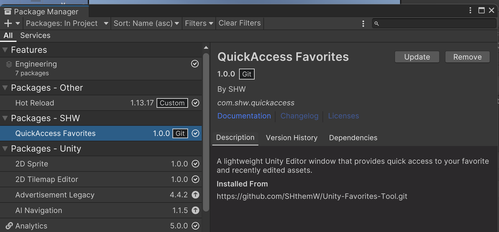
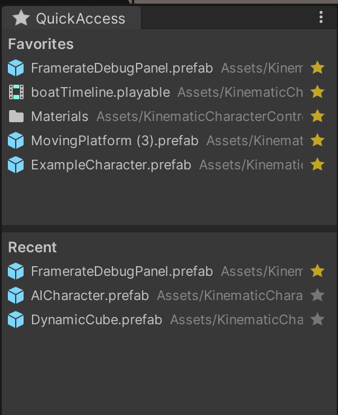
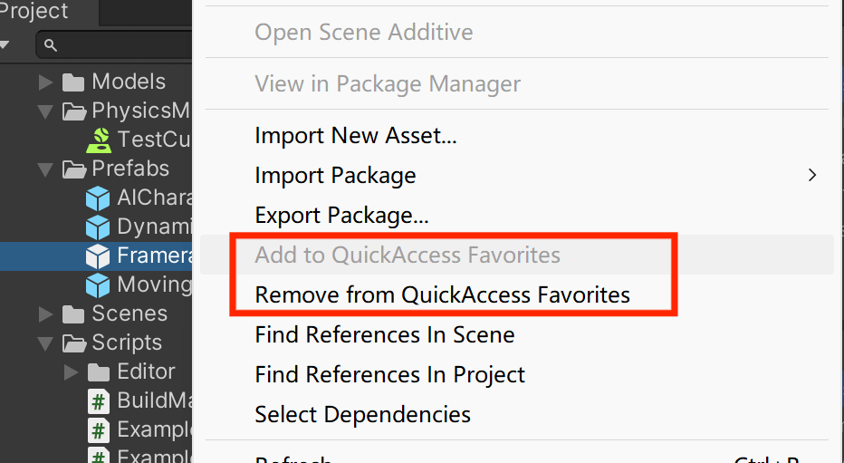

# Unity QuickAccess - Favorites Tool

A lightweight Unity Editor window that provides quick access to your favorite and recently edited assets.

## Features

- **Favorites Panel** — Star any asset to pin it to your favorites list for instant access.
- **Recent Assets Panel** — Automatically tracks the last 50 assets you saved, imported, or modified.
- **Star Toggle** — Each asset row has a star icon on the right side. Click it to add/remove the asset from favorites.
- **Single Click** — Select and ping the asset in the Project window.
- **Double Click** — Open the asset directly (e.g., open a script in your IDE, a prefab in Prefab Mode, etc.).
- **Context Menu** — Right-click any asset in the Project window and choose **Add to QuickAccess Favorites** or **Remove from QuickAccess Favorites**.
- **Resizable Split View** — Drag the splitter bar between the Favorites and Recent panels to adjust their sizes.
- **Persistent Storage** — Favorites and recent lists are saved via `EditorPrefs` and survive Unity restarts.
- **Auto Cleanup** — Deleted or missing assets are automatically removed from both lists.

## Installation

### Option 1: Install via Git URL (Recommended)

1. Open Unity Package Manager (**Window > Package Manager**)
2. Click the **+** button in the top-left corner
3. Select **Add package by git URL...**
4. Enter the repository URL: `https://github.com/SHthemW/Unity-Favorites-Tool.git`
5. Click **Add**

### Option 2: Manual Install

Copy the `QuickAccessWindow.cs` file into any `Editor` folder in your Unity project.

## Usage

Open the window via the menu: **Tools > QuickAccess** (shortcut: `Ctrl+Shift+Q` / `Cmd+Shift+Q`).

### Adding Favorites

| Method                      | How                                                     |
| --------------------------- | ------------------------------------------------------- |
| From the QuickAccess window | Click the star icon on any asset row                    |
| From the Project window     | Right-click an asset > **Add to QuickAccess Favorites** |

### Removing Favorites

| Method                      | How                                                          |
| --------------------------- | ------------------------------------------------------------ |
| From the QuickAccess window | Click the star icon again to unstar                          |
| From the Project window     | Right-click an asset > **Remove from QuickAccess Favorites** |

## Requirements

- Unity 2021.3 or later (uses C# 10 `new()` syntax)

## License

MIT

 
 

# Unity QuickAccess - 收藏夹工具

一个轻量级的 Unity 编辑器窗口，提供对收藏资源和最近编辑资源的快速访问。

## 功能特性

- **收藏夹面板** — 将任意资源标星，固定到收藏夹以便随时访问。
- **最近访问面板** — 自动追踪最近保存、导入或修改过的 50 个资源。
- **星标切换** — 每个资源行右侧都有星标图标，点击即可添加/移除收藏。
- **单击** — 选中资源并在 Project 窗口中高亮定位。
- **双击** — 直接打开资源（如在 IDE 中打开脚本、进入 Prefab 编辑模式等）。
- **右键菜单** — 在 Project 窗口中右键任意资源，选择 **Add to QuickAccess Favorites** 或 **Remove from QuickAccess Favorites**。
- **可调节分割视图** — 拖拽收藏夹和最近访问面板之间的分割条来调整各区域大小。
- **持久化存储** — 收藏列表和最近访问列表通过 `EditorPrefs` 保存，重启 Unity 后数据不丢失。
- **自动清理** — 已删除或丢失的资源会自动从列表中移除。

## 安装方法

### 方法 1：通过 Git URL 安装（推荐）

1. 打开 Unity Package Manager（**Window > Package Manager**）
2. 点击左上角的 **+** 按钮
3. 选择 **Add package by git URL...**
4. 输入仓库 URL：`https://github.com/SHthemW/Unity-Favorites-Tool.git`
5. 点击 **Add**

### 方法 2：手动安装

将 `QuickAccessWindow.cs` 文件复制到 Unity 项目中任意 `Editor` 文件夹下即可。

## 使用方法

通过菜单打开窗口：**Tools > QuickAccess**（快捷键：`Ctrl+Shift+Q` / `Cmd+Shift+Q`）。

### 添加收藏

| 方式                  | 操作                                        |
| --------------------- | ------------------------------------------- |
| 在 QuickAccess 窗口中 | 点击资源行右侧的星标图标                    |
| 在 Project 窗口中     | 右键资源 > **Add to QuickAccess Favorites** |

### 移除收藏

| 方式                  | 操作                                             |
| --------------------- | ------------------------------------------------ |
| 在 QuickAccess 窗口中 | 再次点击星标图标取消收藏                         |
| 在 Project 窗口中     | 右键资源 > **Remove from QuickAccess Favorites** |

## 环境要求

- Unity 2021.3 或更高版本（使用了 C# 10 的 `new()` 语法）

## 许可证

MIT
